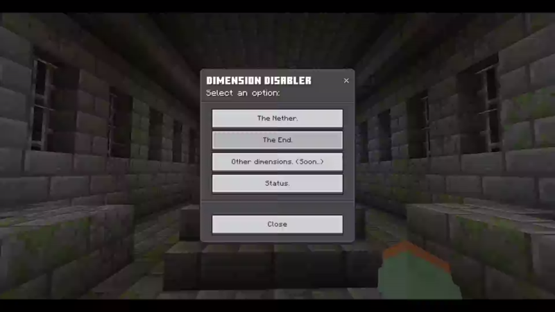

# DIMENSION DISABLER ADDON

##### By: Redmond Limited Co.

### A Minecraft Bedrock addon to stop your friends speedrunning minecraft on your SMP

Surely you have friends who as soon as they start a world, think they are in a speedrun, in the next 5 minutes they are already in the nether and in the next 5 minutes they are already in the End? 

---

##### This script prevents them from being able to play in those dimensions.

---

When they enter a dimension, they will not able to move during some seconds, then will get teleported back to the overworld by default, all restrictions are highly customizable:




### USAGE:

The setting dialog can be invoqued using the command:

```
/ddisabler
```

Don't worry, you need to be the operator (admin) to use this command... talking about that... this addon don't remove achievements.

---

##### You can customice the setting per each dimension:

One for The Nether, The End and very soon for another Dimensions.

---

##### The setting are simple:

`Enable restriction?: it's a toggle.`

This will enable or disable the restriccion on the selected dimension, take in count that if you disable the restriction your configs will saved until you reenable the restricions.


`Enable teleport: it's a toggle.`

This will enable the teleporting back to the overlworld.


`Time until teleport: it's a text field.`

This will set the time until the player gets teleport back to the overlworld, it use seconds... can you put zero? yeah, that will teleport back the soon as possible.


`Show message: it's a toggle.`

This will enable or disable the message showing on the selected dimension, even if teleporting is disabled... you can disable teleport and let this toggle enabled, that way you can welcome the players to the desired dimension.


`Time until show the message: it's a text field.`

This will set the time until the player gets teleport back to the overlworld, it use seconds... can you put zero? yeah, that will teleport back the soon as possible.


`Message to show: it´s a text field.`

This will set the message to show when the player enter the dimension, you can use the text formatting.

---

##### On the status screen you can see all the restrictions status from one place.

***

## What's new on 1.4.0?

- Updated API used.

- Revamped UIX to use the new custom forms.

---

## FOR DEVELOPERS:

You can access the addon data using:

`world.getDynamicProperty()` and `player.getDynamicProperty()` All data used by this addon will be stored in `dd:*data*` format. This is usefull if you want to make your own UI to customice this addon behavior or want to take some additional actions with your players.

### World Data:

`dd:version`: number, The current version of the addon config (not the addon itself) when addon boot on an existing world, checks if this version data exists, if not or if its different, sets the data from this list (and their default values) on the world.

`dd:isNetherEnabled`: boolean, This determines if restriction is enabled on the nether.

`dd:isEndEnabled`: boolean, This determines if restriction is enabled on the end.

`dd:netherMsg`: string, Stores the message to show when entering the nether.

`dd:endMsg`: string, Stores the message to show when entering the end.

`dd:netherTpToggle`: boolean, This determines if teleport triggers on the nether.

`dd:endTpToggle`: boolean, This determines if teleport triggers on the end.

`dd:netherTimer`: number, The time until nether teleporting triggers on the nether.

`dd:endTimer`: number, The time until end teleporting triggers on the end.

`dd:endMsgToggle`: boolean, This determines is message shows on the nether.

`dd:endMsgToggle`: boolean, This determines is message shows on the end.

`dd:netherMsgTimer`: number, The time until message showing triggers on the nether.

`dd:endMsgTimer`: number, The time until message showing triggers on the end.


### Player Data:

This data will be added to the player who teleports into dimensions.

`dd:isRestricted`: boolean, This determines if player must be restricted or not, it will be true if some restriction is enabled when joins the nether/end dimension, this data turns "false" when enters the overworld.

`dd:isTpPendant`: nether/end, This will determines if player must be teleported to the overworld when joins the world, this data doesn't get removed but teleports only triggers on nether/end while teleporting back is enabled.

`dd:fromLocX`: number, the X coordinate where the player got teleported out of the overworld.

`dd:fromLocY`: number, " "

`dd:fromLocZ`: number, " "

Those last data stores the coords thats player enters when get teleported to the nether/end.

***
